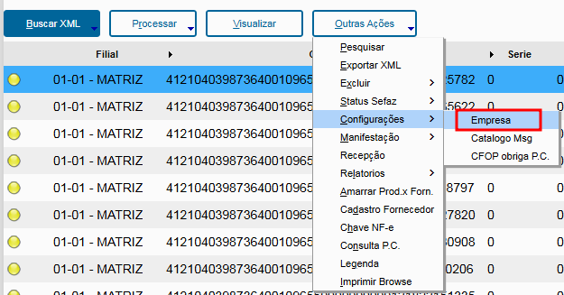
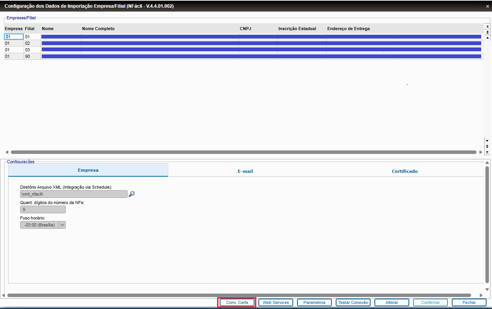
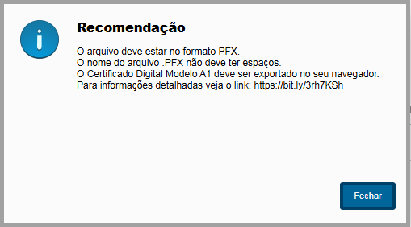
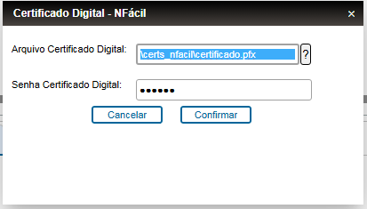
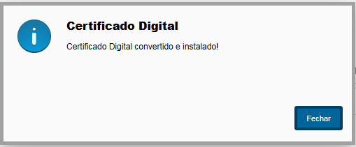
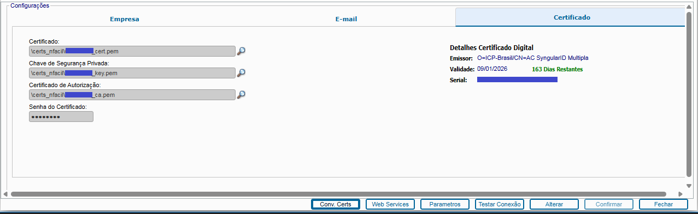

Para Converter e Instalar o(s) Certificado(s) Digital(is) no NFácil, siga o procedimento abaixo:

  * Acesse o caminho:

NFacil > Outras Ações > Configurações > Empresa

* Acesse o botão "Conv. Certs":

* Será apresentada a janela de "Recomendação", com os detalhes que devem ser observados para a correta conversão do certificado digital:
  * O arquivo deve estar no formato PFX.
  * O nome do arquiov.PFX não deve ter espaços.
  * O Certificado Digital Modelo A1 deve ser exportado no seu navegador.
  * Para informações detalhadas veja o link: https://bit.ly/3rh7KSh
 

* Na sequência será apresentada a janela de diálogo para seleção do certificado digital e informar a senha do mesmo, que deve ser preenchida, preferencialmente, indicando o caminho padrão do diretório de certificados do NFácil, "\certs_nfacil\", onde deve estar o arquivo do Certificado Digital atualizado no formato "PFX".

* Será apresentada a janela de confirmação da conversão e instalação do certificado digital.

* Sendo o Certificado Digital corretamente convertido, o mesmo já será instalado e configurado no NFácil, que pode ser verificado na aba "Certificado".

Por padrão o nome dos arquivos instalados será a raiz do CNPJ da empresa a qual pertence o Certificado Digital.
