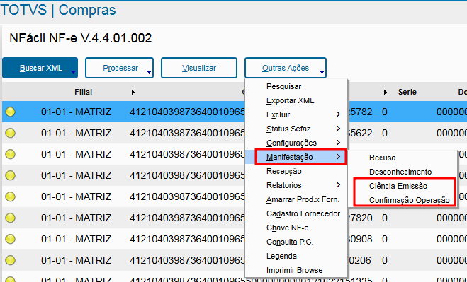
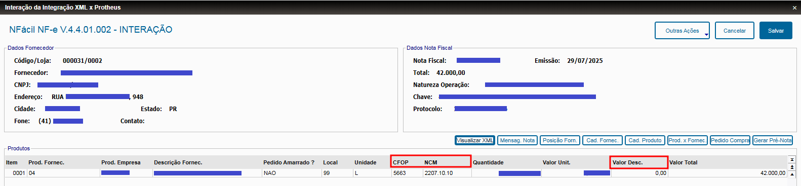
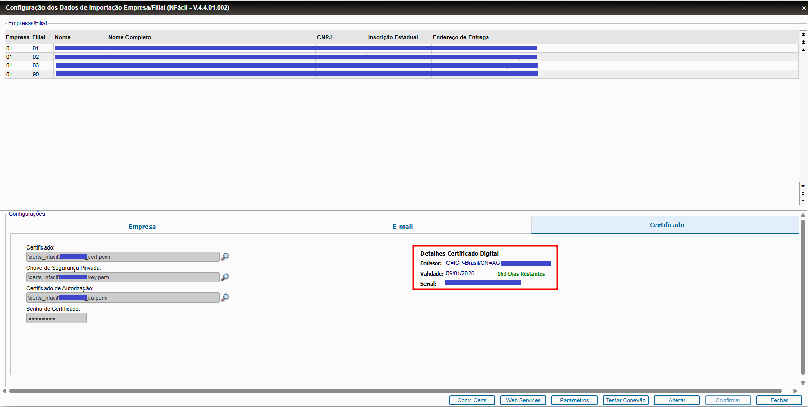
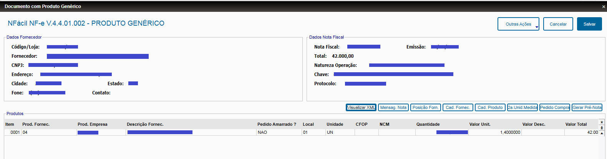
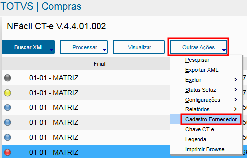
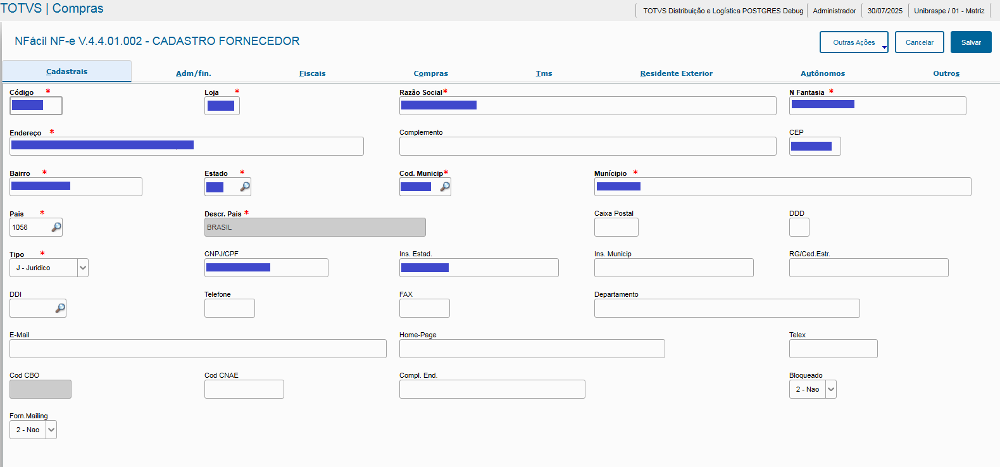

# Liberação da versão 4.4.01.002 do NFácil

Estamos disponibilizando uma atualização do NFácil, para realizar a mesma, siga o roteiro disponível [aqui](update.md).

## Atualizações disponibilizadas

- Manifestação NFe pelo menu
- Informações adicionais no grid de Interação da NFe
- Apresentação dos dados do Certificado Digital na aba Certificados
- Nova tela de Interação de Produtos Genéricos
- Cadastro do Fornecedor diretamente no NFácil
- Parâmetros distintos para Frete de Compra e Frete de Venda
- Correções diversas

> A AFSouza está à disposição dos seus clientes para realizar a atualização do NFácil, conforme sua necessidade ou preferência. Entre em contato com o seu Gerente de Projetos AFSouza para orçamento e agendamento.

### Manifestação NFe pelo menu
O NFácil já disponibilizava as operações de **Recusa** e **Desconhecimento**, as operações de **Ciência de Emissão** (Ciência da Operação) e **Confirmação de Operação** eram realizadas automaticamente. Agora as mesmas podem ser realizadas manualmente, se houver essa necessidade.

As operações de Ciência de Emissão, efetuada quando da baixa do arquivo XML pelo portal da Sefaz, e de Confirmação de Operação, realizada normalmente na classificação do Documento de Entrada, continuam sendo processadas automaticamente pelo NFácil.

### Informações adicionais no grid de Interação da NFe
Visando disponibilizar mais informações sobre os itens da nota fiscal para facilitar e agilizar a conferência dos mesmos, foram acrescentadas as colunas CFOP, NCM e Valor Desconto.

### Apresentação dos dados do Certificado Digital na aba Certificados
Para facilitar a administração dos certificados digitais instalados e configurados no NFácil, principalmente na consulta da data de vencimento do respectivo certificado, essas informações estão disponíveis na aba de **Certificado** na Configuração da Empresa.

### Nova tela de Interação de Produtos Genéricos
Buscando padronizar a interface do NFácil e tornar a mesma mais simples, a tela de Interação de NFe de produtos genéricos foi remodelada e compatibilizada com a tela da Interação padrão.

### Cadastro de Fornecedor 
Quando um arquivo XML, tanto de NFe, quanto de CTe, for importado e o Fornecedor ainda não está cadastrado, agora é possível realizar o cadastro do mesmo no próprio NFácil. Com o registro no browser posicionado deve ser selecionada a opção no menu, no caminho **Outras Ações > Cadastro Fornecedor**.

Será aberta a tela de cadastramento com os principais campos já preenchidos, sendo necessária a definição do código/loja, se o mesmo não for gerado automaticamente, mas se houver necessidade qualquer dado pode ser alterado ou corrigido.

### Parâmetros distintos para Frete Compra e Frete Venda
Muitas empresas utilizam apenas um único código para o produto Frete, quando do lançamento do Documento de Entrada/Nt.Conhecimento Frete de CTe, porém em muitas outras são criados códigos distintos para o Frete de itens comprados e outro para os itens vendidos. 

Quando temos este último cenário, uma forma de solucionar esta limitação é usar um ponto de entrada do NFácil para gerar o documento com o código correto.

A partir deste release do NFácil é possível definir um código para o Frete Compra e outro para o Frete Venda, a partir dos parâmetros abaixo:

- **NF_XNFLPCT**: Produto Frete COMPRA utilizado na importacao do CT-e
- **NF_XNFLPVT**: Produto Frete VENDA utilizado na importacao do CT-e

Para os clientes que utilizam apenas um código de produto Frete, os dois parâmetros devem ser preenchidos com a mesma informação.
