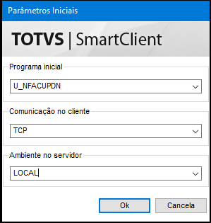
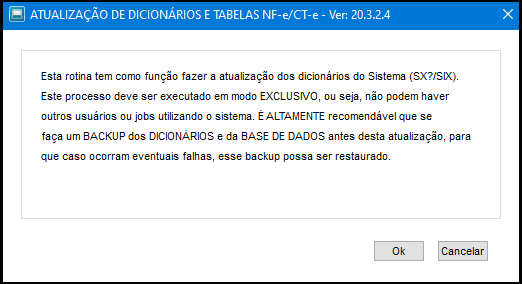
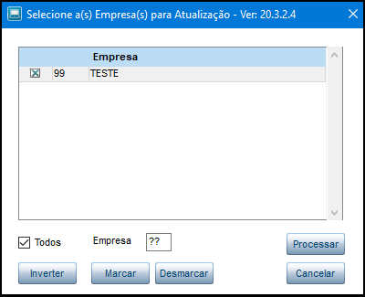
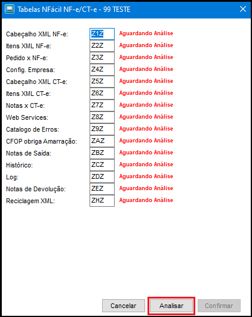
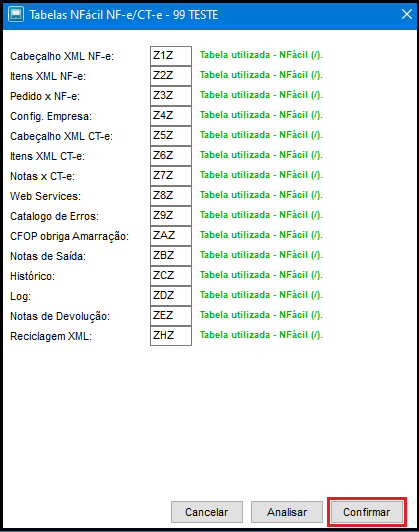
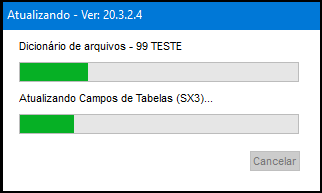
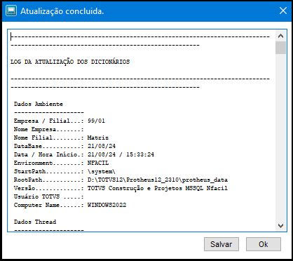
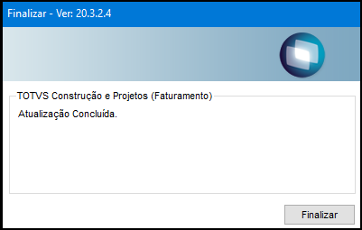

Aqui você encontrará um passo a passo para auxiliar na atualização do NFácil.

O primeiro passo é baixar a versão atualizada do patch do NFácil, correspondente ao Release do Protheus em uso no seu ambiente.

É recomendado que este procedimento seja realizado em ambiente de Homologação e validado antes de ser implementado em ambiente de produção.

Verifique qual a versão correta para seu ambiente e realize o download através  dos links abaixo.

[Patch de atualização NFácil 4.4.01.002 para Protheus 12.1.2210](https://drive.google.com/file/d/1SEGscl7kFkfcdNOAJ7q63L7WCJfv3MiU/view?usp=sharing)

[Patch de atualização NFácil 4.4.01.002 para Protheus 12.1.2310](https://drive.google.com/file/d/179mMKnNbUU5Wm8CMSDbY4sM6zIn8yKW3/view?usp=sharing)

[Patch de atualização NFácil 4.4.01.002 para Protheus 12.1.2410](https://drive.google.com/file/d/1NDWo1jM0nUDjtsSONvtamxehPSTC2cON/view?usp=sharing)

Com o arquivo em mãos, efetue a aplicação do patch e em seguida execute a rotina **U_NFACUPDN** para compatibilização do ambiente.

Será apresentada a tela de avisos da atualização, com as recomendações, que devem ser observadas para evitar problemas após uma atualização mal sucedida!

Selecionar as empresas que serão atualizadas.

A rotina irá realizar uma verificação das tabelas em uso pelo NFácil e/ou pelo Sistema.

Verifique se as tabelas estão em uso pelo NFácil, se houver alguma nova tabela, observe se a mesma está como "Tabela Disponível" ou "Tabela utilizada - SISTEMA", neste último caso informe uma outra tabela, preferencialmente seguindo o padrão do NFácil "Z?Z" e execute a análise novamente.

Se estiver tudo certo vai ser apresentada a tela abaixo.

Aguarde a finalização da atualização.

Com a finalização da atualização será apresentada a tela para consultar e/ou gravar o log do processamento realizado.

Atualização cocluída!

