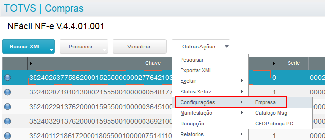
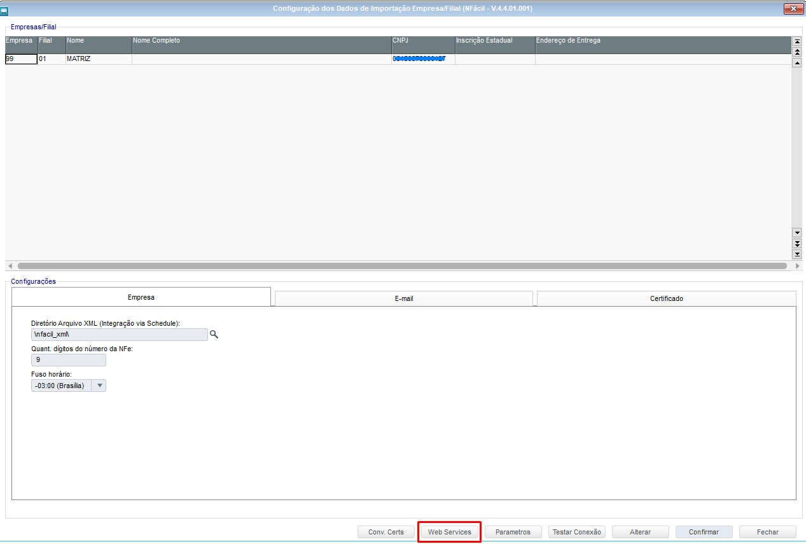
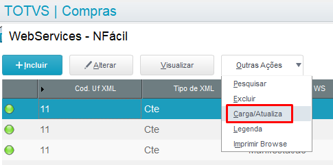

Para que os endereços (URL) dos Serviços Web da Sefaz para [NFe](https://www.nfe.fazenda.gov.br/portal/webServices.aspx) e [CTe](https://www.cte.fazenda.gov.br/portal/webServices.aspx   ) sejam atualizados é necessário que seja realizado o procedimento abaixo:

* Acesse o caminho:

NFacil > Outras Ações > Configurações > Empresa

* Acesse o botão "Web Services":

* Em seguida acesse o caminho:

Outras Ações > Carga/Atualiza

